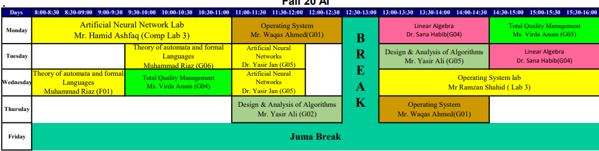

# TIME_TABLE_GENERATOR

This is a simple time table generator for Any educational institution. It is written in python and uses the Libxl library for writing to excel. files.

## Pre-requisites

1. Visual Studio
2. MySQL Server
3. LIBXL Library added to project's dependencies

## Using the Project

1. Run /Data/database2.sql to create the required database in MySQL
2. Add both files into appropriate tables from /Data/*.csv (Or add your own data in the same format)
3. Open up the project as a Visual Studio Project.
4. Modify the rooms and labs arrays in  algorithm() function in main.cpp according to available rooms and labs.
5. Run main.cpp

## Output
 
This will generate four Excel files.
1. Teachers : This file will have the timetables for every teacher. 
2. Rooms    : This file will have the timetables for every room.
3. Classes  : This file will have the timetables for all classes.

The output will look something like this:

|  |
|-------------------------------------------------|

